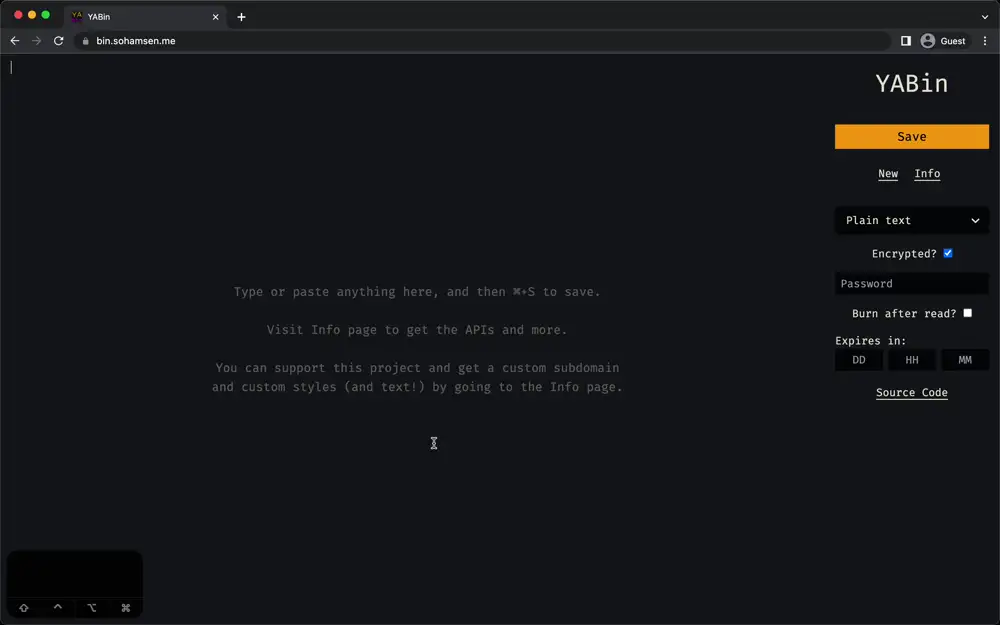

<h1 align="center">YABin: Yet Another Pastebin</h1>

<p align="center">
  <a href="https://github.com/sponsors/Yureien"></a>
  <a href="https://github.com/Yureien/YABin/blob/master/LICENSE"></a>
  
  <a href="https://bin.sohamsen.me/"></a>
</p>
<p align="center">
 <a href="https://ko-fi.com/A0A21C34E"></a>
</p>

## Demo



## Why (yet) another pastebin?

Well, cause no pastebin I could find had ALL of the following features:

-   Modern and minimal UI (This site's design was inspired by bin).
-   Optional end-to-end encryption (we're using AES-256-GCM) with optional password protection (using PBKDF2).
-   Syntax highlighting (using Prism) that supports 297 languages.
-   API support to create and get pastes from command line.
-   View raw pastes. Normally, encrypted pastebins do not have this. With this site, you can either get the Base64-encoded encrypted paste, or decrypt it on the server side (even with the password) and get the raw paste.
-   Keyboard shortcuts!
-   And of course, being fully open-source and easily self-hostable.
-   Ability to edit pastes after creation, and a dashboard for viewing all your pastes.
-   **NEW** Feature to use custom path names.
-   **Comes with a CLI tool to create and read pastes from the command line!**

## API Documentation

See [API.md](API.md).

## CLI Usage

### Installation and Usage

```bash
pip install yabin
yabin create
yabin read "<URL>"
```

See [cli/README.md](cli/README.md) for detailed instructions and library usage.

## How to Host

**Requirements:** Node.js (tested on 18+, should work with 14+), and a SQL database (tested on PostgreSQL, should work with MySQL and SQLite).

Right now, my instance is using PostgreSQL on Vercel.

### .env Configuration

By default, it is configured to use PostgreSQL. However, it can be run using any SQL DB such as SQLite or MySQL. To use other backends, please update the provider in [schema.prisma](src/lib/server/prisma/schema.prisma).

- `DB_NAME` is the database name;
- `DB_HOST` database host (defaults to 'db', but can be changed to aything like localhost)
- `DB_USER` database user
- `DB_PORT` database port 5432
- `DB_PASSWORD` the database user password
- `DATABASE_URL` you don't need to modify this variable (thanks to dotenv-expand). keep it though!

Remember to modify `SALT` to something secure if you plan on using user accounts.

You can disable or enable public registration by modifying the `PUBLIC_REGISTRATION_ENABLED` variable to `true` or `false`.

You can enable custom paste paths for everyone with the variable `PUBLIC_CUSTOM_PATHS_ENABLED`. If it is `false`, only users who are logged in can use custom paths.

You can disable anonymous pastes by setting `PUBLIC_ANONYMOUS_PASTES_ENABLED` to `false`.

By default, if no e-mail services are configured, all user accounts will be marked as validated. To enable e-mail validation, please configure the `MAIL_*` variables.

#### Locally

```bash
yarn install
cp .env.example .env
# Modify .env to add the database URL and other parameters
yarn dev
```

#### Using Docker

```bash
docker run --env-file .env -it -p 3000:3000 yureien/yabin:latest
# Or with Docker Compose
# Remember to change the DB password!
docker compose up
```

_Fun fact: At a point of time, my instance used to be hosted in a Kubernetes cluster_

#### Other Serverless Environments (Cloudflare Workers, Netlify etc.)

I have not yet tested this, but this is made with SvelteKit. Please take a look at the [SvelteKit documentation](https://kit.svelte.dev/docs/adapters) for more information. If there are any issues, please open an issue, and I will put up a proper guide on how to deploy on such environmments.

My instance uses Vercel. Checkout the `vercel` branch for the Vercel configuration.

## Public Instances

If you host one and want to make it public, just open an issue and I will add it here!

1. [bin.sohamsen.me](https://bin.sohamsen.me) 
